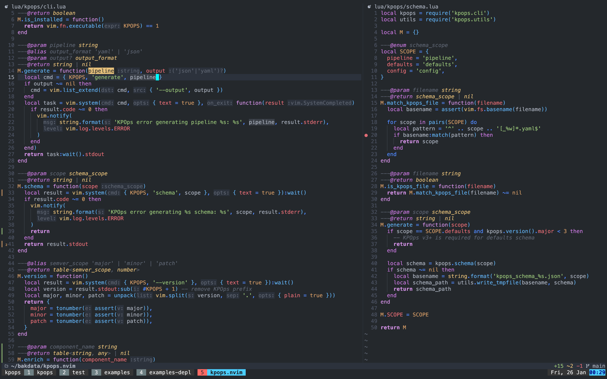

# disrupted's dotfiles

## Neovim



[`~/.config/nvim`](https://github.com/disrupted/dotfiles/tree/master/.config/nvim)

configuration entirely written in Lua.

## Shell

[`~/.zshrc`](https://github.com/disrupted/dotfiles/blob/master/.zshrc)

ZSH using powerlevel10k prompt. plugins managed through zinit.

## Weechat IRC


> Thanks to [@lukas-reineke](https://github.com/lukas-reineke/dotfiles), [@akinsho](https://github.com/akinsho/dotfiles), [@yutkat](https://github.com/yutkat/dotfiles) and the good people from [/r/neovim](https://reddit.com/r/neovim).

---

### Misc

test italics & similar output:

```sh
echo -e "\e[1mbold\e[0m"
echo -e "\e[3mitalic\e[0m"
echo -e "\e[4munderline\e[0m"
echo -e "\e[9mstrikethrough\e[0m"
echo -e "\e[31mHello World\e[0m"
```

from ['A Definitive Guide to Enabling Italics in Vim and tmux'](https://www.reddit.com/r/vim/comments/fr6zfl/a_definitive_guide_to_enabling_italics_in_vim_and/):

Instead of adding a custom entry in the terminfo db, try to update the latter. On my Ubuntu, terminfo descriptions are provided by the packages ncurses-base and ncurses-term. If after upgrading the pacakges, your descriptions are still too old – or contain wrong sequences – then update the db right from the developer's site:

```sh
$ curl -LO http://invisible-island.net/datafiles/current/terminfo.src.gz
$ gunzip terminfo.src.gz
$ tic -sx terminfo.src
```

On Ubuntu, it should create a new db in your home directory (~/.terminfo). If you don't want to update the whole db, but only the description of a specific terminal, then replace the last tic(1) command with:
`tic -sx -e $TERM terminfo.src`
Or with:
`tic -sx -e my-terminal terminfo.src`
Or:
`tic -sx -e my-terminal-1,my-terminal-2,... terminfo.src`
If you want to make a backup of the current description, run this command:
`infocmp -x $TERM >term.desc.backup`
And to restore your original description, run:
`tic -sx term.desc.backup`

[Installing tmux-256color for macOS](https://gist.github.com/bbqtd/a4ac060d6f6b9ea6fe3aabe735aa9d95)

[Patched tmux-256color terminfo from tmux maintainer](https://gist.github.com/nicm/ea9cf3c93f22e0246ec858122d9abea1)
